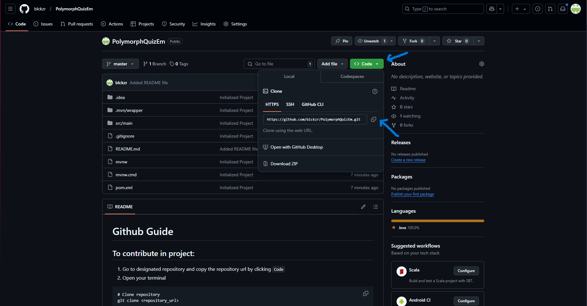
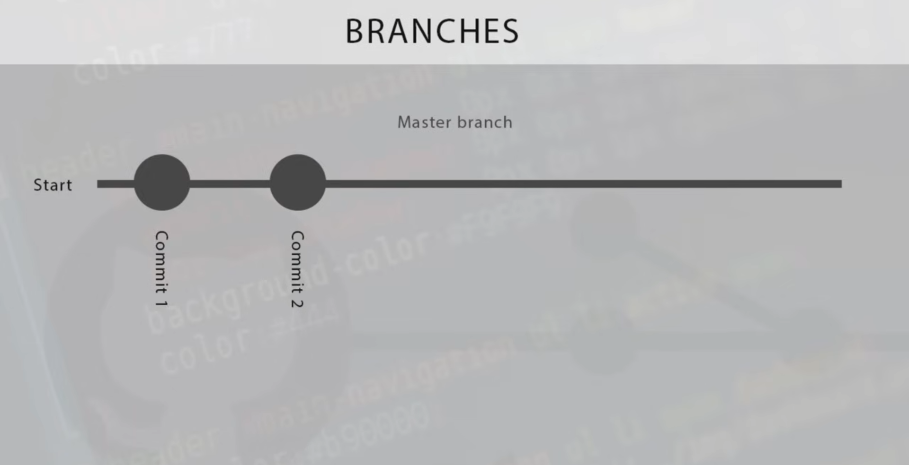
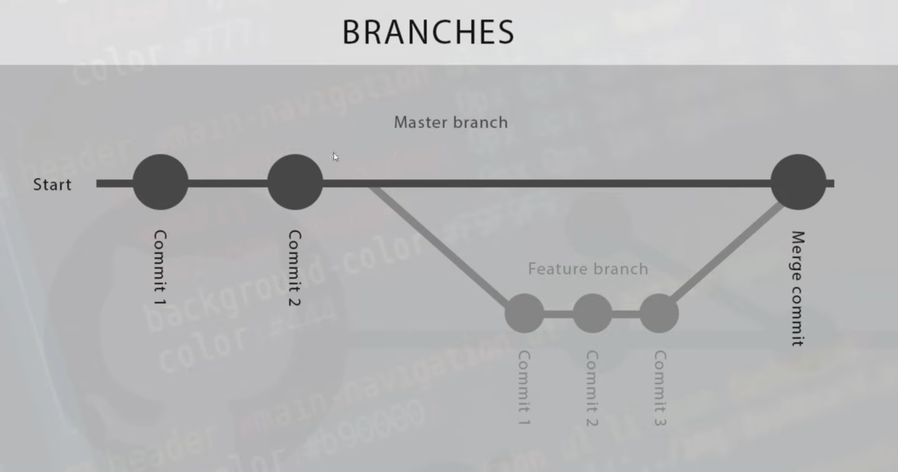

# Github Guide

## To contribute in project:
1. Go to designated repository and copy the repository url by clicking `Code`

2. Open your terminal
```
# Navigate the desired folder for clone repository
cd <file_path>

# Clone repository
git clone <repository_url>
```
3. You may now start working

# Two ways to upload your code:

## Main branch coding:

The main branch is the central branch where the primary version of the project resides. It is often considered the "production-ready" or "stable" version of the code. When coding directly in the main branch, all changes made to this branch will immediately affect the codebase as a whole. These changes can impact the entire project, including other branches that may later merge with the main branch.
After making changes to the code:
```
# Add the code to stage
git add -A

# Commit changes
git commit -m "{commit message}"

# Send the changes
git push
```
1. Add changes to the staging area (files you will commit) using `git add .` or `git add -A.`
2. Commit changes using `git commit -m "{commit message}"`. Make sure your commit messages are descriptive.
3. Push your changes to your fork using `git push`.

## Alternate branch coding (Recommended):

A branch acts as a separate workspace, allowing you to work on specific features, bug fixes, or experiments without affecting the main branch or other developers’ work. This isolation helps prevent introducing bugs or unfinished code into the main project. Branches also simplify collaboration by enabling multiple developers to work on different tasks simultaneously without interference.


```
# Create and switch to a new branch
git checkout -b <new_branch_name>

# Upload changes
git add -A
git commit -m "{commit message}"
git push origin <new_branch_name>

# Switch to master branch
git checkout master

# Merge with main branch
git merge <{new_branch_name}>

# Pull latest version
git pull origin master
```
1. Create and switch a new branch using `git checkout -b <new_branch_name>`. You can decide what the branch name.
2. Upload the changes and wait for the approval from the owner of the repository.
3. Switch branch using `git checkout <branch_name>`. After pushing the changes, change to `master` branch
4. Merge main and chosen branch using `git merge <{new_branch_name}>`. Change `{new_branch_name} with branch you want to merge with master.
5. Update the clone repository using `git pull origin master` if the repository is updated.

# REFERENCES:
[Git & GitHub Tutorial for Beginners](https://youtube.com/playlist?list=PL4cUxeGkcC9goXbgTDQ0n_4TBzOO0ocPR&si=cxNCOabily6Cy9ZT)

[Git Explained in 100 Seconds](https://www.youtube.com/watch?v=hwP7WQkmECE&t=90s)
